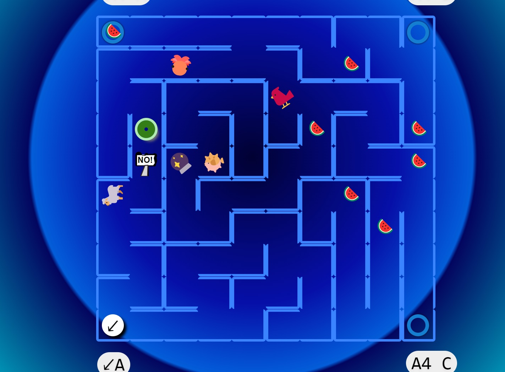

# Infinitum Labyrinth - Space Un-LIMITed (game)

AweSkyBear's entry for LDJAM 54

**Theme**: Limited Space

**Game**: **Infinitum Labyrinth - Space Un-LIMITed**

---

<blockquote>
 The (evil) Rubber Duck (or sth) has turned you into a green DOUGHNUT and entrapped you into an infinite maze.

 Still, you can control the size of the maze, from super tiny (6x6) to SUPER LARGE (35x35) for the game mode.

 Face creepy (or awkward) foes around! 🏀🐡🦞👻📛

 Eat watermelon to get 💡HINTS.. to use them if you get stuck into the infinity loop...

 Escape the maze...

 Can you outsmart the Evil Rubber Duck? 🦆

 Be the BEST 🍩 doughnut... be the best version of yourself!
</blockquote>

## Modes

### The Game

Play the game and try to beat all the levels, up to the end.

### Free Roam

Tinker with the maze and just *roam freely* infinitely. In-game instructions available. **The final maze is sharable as a URL via the GIFT button!**

## Credits

This is a pure HTML5 (HTML + JS + CSS, not even `canvas` el!). `obs-disp` for the general event-driven architecture.

- programming: TypeScript, [`obs-disp`](https://aweskybear.github.io/obs-disp/) for rapid and decoupled event-driven architecture
  - setup based on [obs-disp-starter-basic](https://github.com/AweSkyBear/obs-disp-starter-basic)
- music: 2 tunes via MIDI-generation software + sound fonts (.SF2 files)
- libraries / npm:
  - `prando` - general pseudo randomness
  - `maze-generation` - ready-made seedable maze generation (again pseudo randomness)
    - included locally due to build issue:
      - https://www.npmjs.com/package/maze-generation
      - https://github.com/JRIngram/maze-gen/blob/develop/LICENCE.md
  - `howler` - playing music
  - `jsfxr` - web audio / sound effects
  - ...see the full dependency list in [package.json](./package.json)
- SVGs from https://www.svgrepo.com/
- Emojis from https://emojidb.org/

## Development

`npm start` - to build with webpack, launches a dev server

`npm build` - to build for production

## Tips

- no UI for volume control - hit F12 and change the music volume via `Howler.volume(<value>)` - [0; 1]
- there is a HUGE performance issue when using CSS `filter` on many cells (browser limitations) - use the `FAT` button in the UI to switch to optimized mode; that's done automatically for the game mode

## Challenge!

I challenge you to fork the repo and create mods / extensions / experiments : ) to any part of the game! Add new levels, modify existing ones, change the logic, create something more with Free Roam, fix a bug, etc.

And remember: the ultimate goal is to Have Fun!

## License

*GPL3 Affero* so that the source code remains available to everyone.
